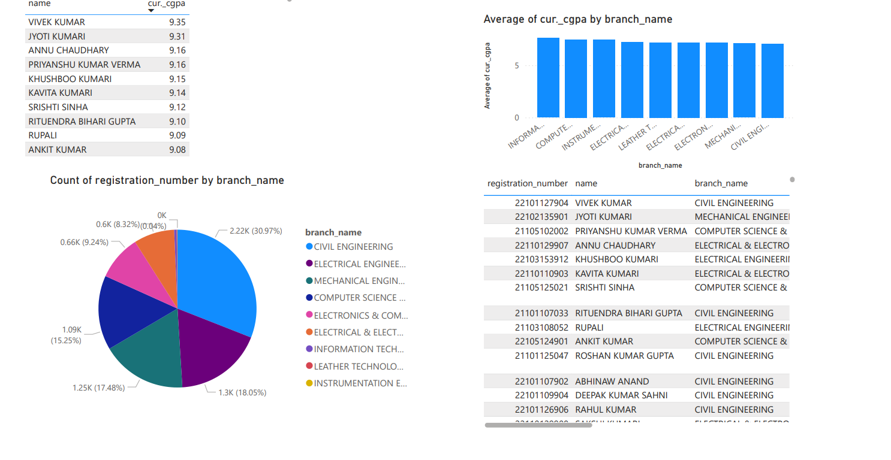

# Academic Performance Analysis – Bihar Engineering University

## 📌 Overview
This project analyzes student performance data from **Bihar Engineering University** using **Python**, **Excel**, and **Power BI**.  
The goal is to generate insights into SGPA, CGPA, college-wise and branch-wise performance, and rank distribution.

---

## 📂 Dataset Description
The dataset includes the following fields:
- Student Name  
- Registration Number  
- Father’s Name  
- Mother’s Name  
- College Name  
- Branch  
- SGPA  
- CGPA  

---

## 🛠 Tools & Technologies
- **Python** (Pandas, Matplotlib, Seaborn) – for data cleaning and analysis  
- **Microsoft Excel** – for initial data formatting  
- **Power BI** – for data visualization dashboards  

---

## 🌟 Key Features
- Cleaned and standardized student academic data  
- Generated **university and branch-wise ranks** based on CGPA  
- Visualized:
  - Top-performing students (university-wide and branch-wise)  
  - Branch-wise and college-wise CGPA averages  
  - SGPA vs CGPA correlation  
  - Student distribution across colleges and branches  

---

## 📈 Insights
- Identified **Top 10 students** across the university  
- Highlighted branches and colleges with consistently high or low performance  
- Suggested areas for **academic intervention**  

---

## ▶️ How to Run
1. Clone the repo  
2. Run the Python notebook for data analysis  
3. Open the Power BI dashboard (`.pbix` file) for visuals  
4. Optionally, export visuals to **PDF/PNG** for reporting  

---

## 🖼 Sample Visuals
*(Include screenshots or links to your visuals here)*  

Sample Visuals
